## About ToothTracker

ToothTracker is a **Dental Clinic Administrative Management System** designed for **dental clinic administration assistants**.
From adding new patient and dentist profiles to seamlessly creating appointment schedules, ToothTracker is
engineered to simplify every aspect of your dental clinic administrative responsibilities.

 

**Why ToothTracker? Because Your Time Matters.**  
In your bustling dental clinic, time is the rarest commodity. That's why we designed ToothTracker to be swift like your service,
allowing you to **manage patient and dentist records efficiently**, **schedule appointments without overlaps**,
and ensure your clinic operates like a well-oiled machine — all through a versatile Command Line Interface (CLI)
that responds to your speedy typing, along with a Graphical User Interface (GUI) that includes a user-friendly calendar.

 

**ToothTracker's Core Features Designed with You in Mind**

- **Digital Record Keeping:** Say goodbye to cumbersome physical files — store and manage patients, dentists and appointments digitally.
- **Effortless Retrieval:** Use intuitive `search` and `filter` commands to access and retrieve patient and dentist records.
- **Tagging System:** Add tags to every patient and dentist to highlight key information about them.
- **Smart Scheduling:** Eliminate double-bookings and optimize your clinic's operations with appointment management.
- **Custom Treatments:** Tailor ToothTracker to reflect the unique treatments your clinic provides.
- **Visual Calendar:** Get a clear overview of your day-to-day operations with our comprehensive calendar view.

Head over to [How to use ToothTracker's User Guide](#how-to-use-toothtrackers-user-guide) to start tracking your dental clinic records!







## How to use ToothTracker's User Guide
Thank you for choosing ToothTracker! We are delighted to have you as a user!
This user guide provides a comprehensive documentation on the various commands supported by ToothTracker.

  
    :bulb: **Tip:** Our user guide is designed for **ease of navigation**. Simply click on any item in the Table of Contents
    to jump directly to that section. Clicking on the **headings** within each section will return you to the Table of Contents,
    so it's easy to navigate between sections!
  

{: .no_toc}
#### First-Time Setup
If you are new to ToothTracker, let's begin by setting up the application. Visit the [Installation](#installing-toothtracker)
section for a straightforward guide to get ToothTracker up and running smoothly on your system.

{: .no_toc}
#### Basic Operations
Already installed ToothTracker? Great! You can head over to the [Familiarising with ToothTracker's Interface](#familiarising-with-toothtrackers-interface)
section which covers the basics of using ToothTracker.

{: .no_toc}
#### Quick Reference
Seasoned users can refer to the [Command Summary](#command-summary), a concise cheat sheet that encapsulates all ToothTracker
commands for quick reference.

{: .no_toc}
#### Support and Troubleshooting
Encountered an issue or have a question? Our [Troubleshooting](#troubleshooting) and [FAQ](#faq) sections are here to
help troubleshoot common issues and provide answers swiftly.

### Icons used in this guide

Throughout this guide, you'll find helpful tips and cautionary advice to ensure a smooth ToothTracker experience.

| Icon                          | Meaning                                  |
|-------------------------------|------------------------------------------|
| :information_source:  **Note** | Information you should keep in mind.     |
| :bulb: **Tip**                | Information you might find useful.       |
| :exclamation: **Caution**     | Information you should be careful about. |







## Features
This section shares with you on how to use each feature in detail.

**:information_source: Notes about the command format:** 

* Words in `UPPER_CASE` are the input parameters you need to provide. 
  e.g. in `add-dentist n/NAME`, `NAME` is an input parameter which can be used as `add-dentist n/John Doe`.

* Items in square brackets are optional. 
  e.g `n/NAME [t/TAG]` can be used as `n/John Doe t/Professional` or as `n/John Doe`.

* Items with `…`​ after them can be used multiple times including zero times. 
  e.g. `[t/TAG]…​` can be used as ` ` (i.e. 0 times), `t/friend`, `t/friend t/family` etc.

* Input parameters can be in any order. 
  e.g. if the command specifies `n/NAME p/PHONE s/SPECIALIZATION `, `p/PHONE s/SPECIALIZATION n/NAME` is also acceptable.

* Extraneous input parameters for commands that do not take in input parameters (such as `help`, `list-patient`,
  `exit` and `clear`) will be ignored. 
  e.g. if the command specifies `help 123`, it will be interpreted as `help`.

* If you are using a PDF version of this document, be careful when copying and pasting commands that span multiple lines
  as space characters surrounding line-breaks may be omitted when copied over to the application.



### Dentist Features

#### Adding a dentist : `add-dentist`

Adds a dentist to the list of dentists in ToothTracker. This is useful when:
* You are using ToothTracker for the first time, and you have to add your dentists' particulars.
* You are adding a new dentist who has joined your dental clinic.

**Format:** `add-dentist n/NAME p/PHONE s/SPECIALIZATION y/YOE [e/EMAIL] [h/ADDRESS] [t/TAG]…​`

:bulb: **Tip:**
A dentist can have any number of <code>TAG</code>s (including zero tags).

<code>EMAIL</code> and <code>ADDRESS</code> are optional to be put.
You may use the `edit-dentist` command to update them in the future.

**:information_source: Notes about Specializations:** 
By default, ToothTracker only accepts a set of predefined recognized dental specializations. They are: 
  1. Endodontics 
  2. Dental Public Health 
  3. Oral and Maxillofacial Surgery 
  4. Orthodontics 
  5. Paediatric Dentistry 
  6. Periodontics 
  7. Prosthodontics 

This is in accordance to the
[List of Recognised Specializations](https://www.healthprofessionals.gov.sg/dsab/specialist-training/list-of-recognised-specialties)
from The Ministry of Health. Please consult the developers if you need to change the dental specializations!

**:information_source: Notes about adding a dentist without email and address:** 
ToothTracker will put the <code>EMAIL</code> as "NoEmailProvided@ToBeAdded.com"
and put the <code>ADDRESS</code> as "No Address Provided." by default.

If you wish to update them at a later time, you can use <code>edit-dentist</code> to edit them.

**:information_source: Notes about adding dentists with the same name:** 
Each dentist must have a unique name. ToothTracker does not allow multiple dentists with identical names.

**Examples:**
* `add-dentist n/Xavier Roald p/99773311 s/Orthodontics y/1 e/roaldxavier@hotmail.com
h/Yishun Street 72, Blk 742, #03-354, Singapore 512742 t/Trainee` 
This adds a dentist named 'Xavier Roald' with phone number '99773311', specialising in 'Orthodontics' with '1 year of experience',
email 'roaldxavier@hotmail.com', address 'Yishun Street 72, Blk 742, #03-354, Singapore 512742', who is a 'Trainee' into
the list of dentists in ToothTracker.

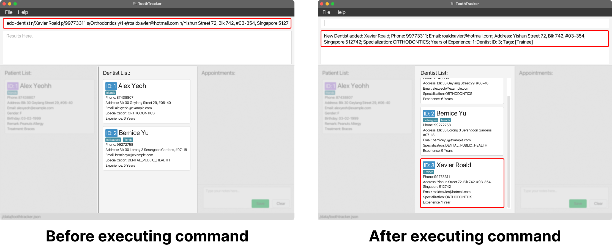{: .centered-image }

* `add-dentist n/Barbara Noel p/93349795 e/barbaranoel@gmail.com y/6 s/Paediatric Dentistry` 
This adds a dentist named 'Barbara Noel' with phone number '93349795' and email 'barbaranoel@gmail.com',
who has '6 years of experience' and specializing in 'Paediatric Dentistry' into the list of dentists in ToothTracker.

{: .centered-image }

* `add-dentist n/Emmanuel Chua p/99887766 y/8 s/prosthodontics t/extraction`  
This adds a dentist named 'Emmanuel Chua' with phone number '99887766' who has '8 years of experience'
specializing in 'prosthodontics' with a tag of 'extraction' into the list of dentists in ToothTracker.

{: .centered-image }

#### Listing all dentists : `list-dentist`

Shows a list of all dentists in ToothTracker. This is useful when:
* You want to retrieve the information of all dentists.
* You want to verify a dentist is added successfully in ToothTracker.
* You want to verify a dentist is updated successfully in ToothTracker.

**Format:** `list-dentist` (No extra parameters required)

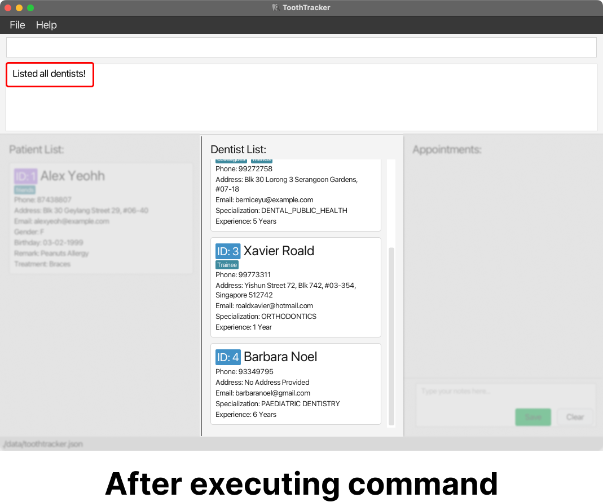{: .centered-image }

#### Deleting a dentist : `delete-dentist`

Deletes the dentist with the specified `DENTIST_ID` from ToothTracker.

**Format:** `delete-dentist DENTIST_ID`

:exclamation: **CAUTION:**
This command is DESTRUCTIVE! Dentists deleted will need to be added back and their previous records may be removed.
**Proceed with caution!**

:bulb: Tip:
To check the <code>DENTIST_ID</code> of a dentist, you can simply enter the command `list-dentist`.

**Examples:**
* `delete-dentist 2`   This deletes the dentist with the `DENTIST_ID` 2.
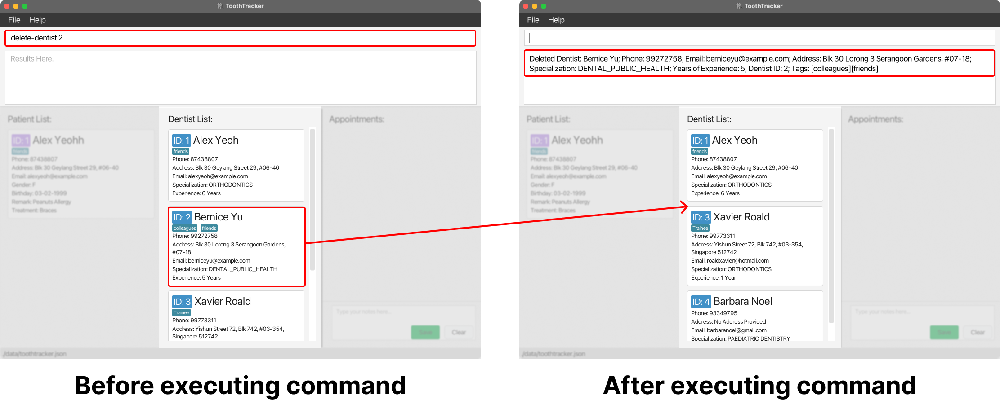{: .centered-image }

* `delete-dentist 20`   This deletes the dentist with the `DENTIST_ID` 20.

#### Searching for dentists by `DENTIST_ID` : `search-dentist`

Searches for a dentist by their `DENTIST_ID` in ToothTracker.
This command helps you find a unique dentist based on the provided `DENTIST_ID`. This is useful when:
* You want to confirm the identity of a specific dentist before using further commands.
* You need quick access to one specific dentist's particulars.

**Format:** `search-dentist DENTIST_ID`

:bulb: **Tip:**
The `DENTIST_ID` refers to the ID shown in the displayed list of dentists.  
To check the `DENTIST_ID` of a dentist, you can simply enter the command `list-dentist`.

**Examples:**
* `search-dentist 5`   This searches for the dentist with `DENTIST_ID` 5.
{: .centered-image }

* `search-dentist 10`   This searches for the dentist with `DENTIST_ID` 10.

#### Searching for dentists by keywords : `search-dentist`

Search for dentists by matching names with a keyword.
This command helps you find dentists that match your search criteria. This is useful when:
* You need to find dentists whose names match your search criteria.
* You forget the `DENTIST_ID` for a dentist and want to search using the dentist's name instead.

**Format:** `search-dentist KEYWORD`

**:information_source: Notes for searching dentists by keyword** 
  <ul>
    <li>The search is performed only on the dentist's name.</li>
    <li>The search is case-insensitive, meaning that it will match both uppercase and lowercase characters. For example, searching for `James` will match both `James` and `james`.</li>
    <li>The order of the keywords in the name does not matter. For instance, searching for `Mike Lim` will match `Lim Mike` as well.</li>
    <li>Sub-strings will be matched. For example, if you search for `Fred`, it will match `Frederick`.</li>
    <li>More than one dentist result might be returned when searching by keywords, especially if multiple dentists match your search criteria.</li>
  </ul>

**Examples:**
* `search-dentist John`   This searches for dentists with names containing the keyword `John`.
{: .centered-image }

* `search-dentist Ronald Lim`   This searches for dentists with names containing the keyword `Ronald Lim`.

#### Filtering dentists : `filter-dentist`

Narrows down your search for dentists based on a specified attributes.
When this command is used, there might be more than one result that matches your search criteria. This is useful when:
* You want to find dentists with specific attributes.
* You want to confirm the identity of a dentist before using further commands.

**Format:** `filter-dentist a/ATTRIBUTE k/KEYWORDS`

:bulb: **Tip:**
To check the attributes that you can filter by, you can simply enter the command `list-dentist`.
Alternatively, a message will be shown in the text box regarding the attributes that you can filter by if you entered an invalid attribute.
We have set the attributes that can be filtered to be:
`name`, `phone`, `specialization`, `experience`, `email`, `address`, `tags`.

**Examples:**
* `filter-dentist a/phone k/98225677`   This filters for dentists with the phone number 98225677.
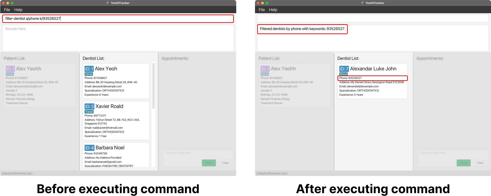{: .centered-image }

* `filter-dentist a/specialization k/Orthodontics`   This filters for dentists with the specialization Orthodontics.
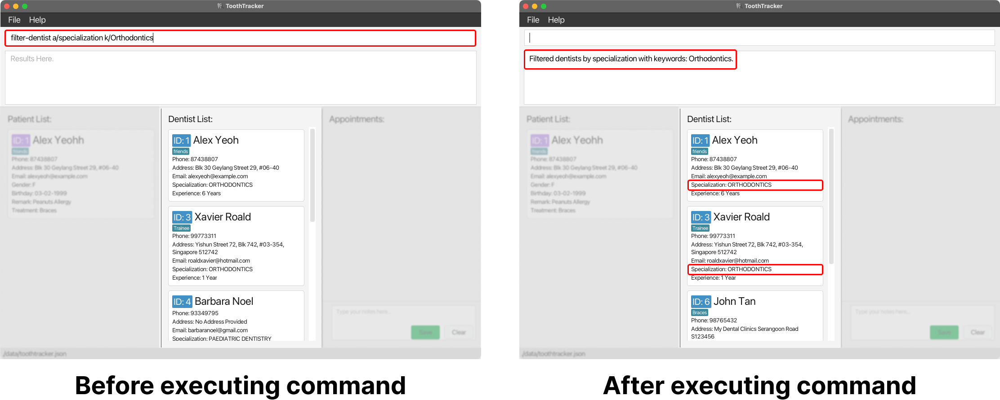{: .centered-image }

#### Editing a dentist : `edit-dentist`

Edits one or more attributes of the dentist at the specified `DENTIST_ID`. This is useful when:
* The particulars of a dentist need to be updated.
* Optional dentist particulars were not provided previously.
* You accidentally entered incorrect information about a dentist into the ToothTrack database.

**Format:** `edit-dentist DENTIST_ID [n/NAME] [p/PHONE] [e/EMAIL] [a/ADDRESS] [s/SPECIALIZATION] [y/YOE] [t/TAG]…​`

:bulb: **Tip:**
You can edit the particulars in any order and edit more than one particulars of the dentist with a single `edit-dentist` command.

:bulb: **Tip:**
To check the `DENTIST_ID` of a dentist, you can simply enter the command `list-dentist`.

**:information_source: Notes about editing tags:** 
When editing tags, you have to include any previous tags that was already included in the dentist, or else these tags will be removed.
This also means that you can use `t/` to remove all tags from a dentist using the <code>edit-dentist</code> command.

**Examples:**

* `edit-dentist 1 p/98987676 e/bobjuly@gmail.com`   This edits the phone number and email of the dentist with
`DENTIST_ID` 1 into 98987676 and bobjuly@gmail.com respectively.
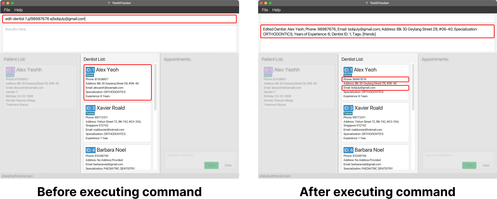{: .centered-image }

* `edit-dentist 5 n/Emmanuel Alexandra t/`  
This edits the name of the dentist with `DENTIST_ID` 5 into ‘Emmanuel Alexandra’ and removes all tags of the dentist.
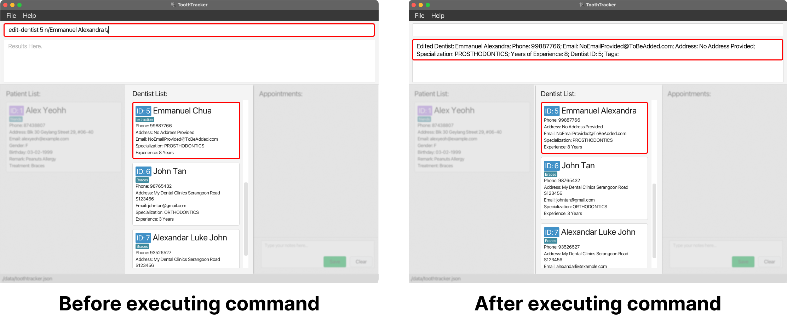{: .centered-image }



### Patient Features

#### Adding a patient : `add-patient`

Adds a patient to the list of patients in ToothTracker. This is useful when:
* You are using ToothTracker for the first time, and you have to add your patients' particulars.
* A new patient has joined your clinic.

**Format:** `add-patient n/NAME p/PHONE b/BIRTHDATE g/GENDER [r/REMARK] [tr/TREATMENT] [e/EMAIL] [h/ADDRESS] [t/TAG]…​`

:bulb: **Tip:**
A patient can have any number of <code>TAG</code>s (including zero tags).

<code>EMAIL</code>, <code>ADDRESS</code>, <code>REMARK</code> and <code>TREATMENT</code> are optional to be put.
You may use the `edit-patient` command to update them in the future.

**:information_source: Notes about adding a patient without remark and treatment:** 
ToothTracker will put the <code>REMARK</code> and <code>TREATMENT</code> as `NIL` by default.

If you wish to update them at a later time, you can use <code>edit-patient</code> to edit them.

**:information_source: Notes about adding a patient without email and address:** 
ToothTracker will put the <code>EMAIL</code> as "NoEmailProvided@ToBeAdded.com"
and put the <code>ADDRESS</code> as "No Address Provided." by default.

If you wish to update them at a later time, you can use <code>edit-patient</code> to edit them.

**:information_source: Notes about adding Treatments:** 
The new treatment must be a valid treatment in ToothTracker. To add a new treatment for your clinic, use the command `add-treatment`.
To view the list of treatments, you can use the command `list-treatment`.

**:information_source: Notes about adding patients with the same name:** 
Each patient must have a unique name and ToothTracker does not allow multiple patients with identical names.

**Examples:**

* `add-patient n/John p/90676622 b/26-06-1998 g/M r/Allergic to Peanuts tr/Braces e/johntan@gmail.com h/60 Harvey Avenue t/Urgent`  
This adds a new patient named ‘John’, with phone number ‘90676622’, birthdate of '26 June 1998', gender 'M' (Male), remark that he is 'allergic to peanuts',
requesting for 'Braces' treatment, email of ‘johntan@gmail.com’, with an address at '60 Harvey Avenue', and a tag 'Urgent'.
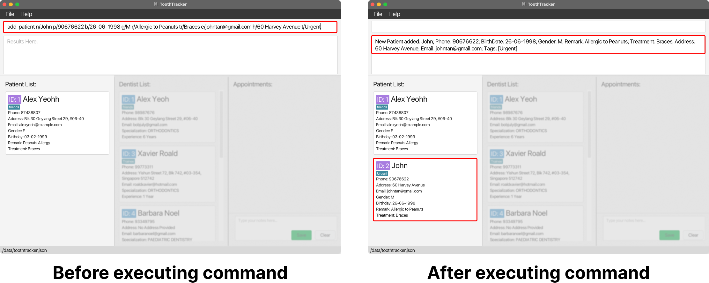{: .centered-image }

* `add-patient n/Jean p/95339212 b/14-09-2001 g/F`  
This adds a new patient named 'Jean', with phone number '95339212', birthdate of 14 September 2001, gender F (Female).
{: .centered-image }

#### Listing all patients : `list-patient`

Shows a list of all patients in ToothTracker. This is useful when:
* You want to retrieve the information of all patients.
* You want to verify a patient is added successfully in ToothTracker.
* You want to verify a patient is updated successfully in ToothTracker.

Format: `list-patient` (No extra parameters required)
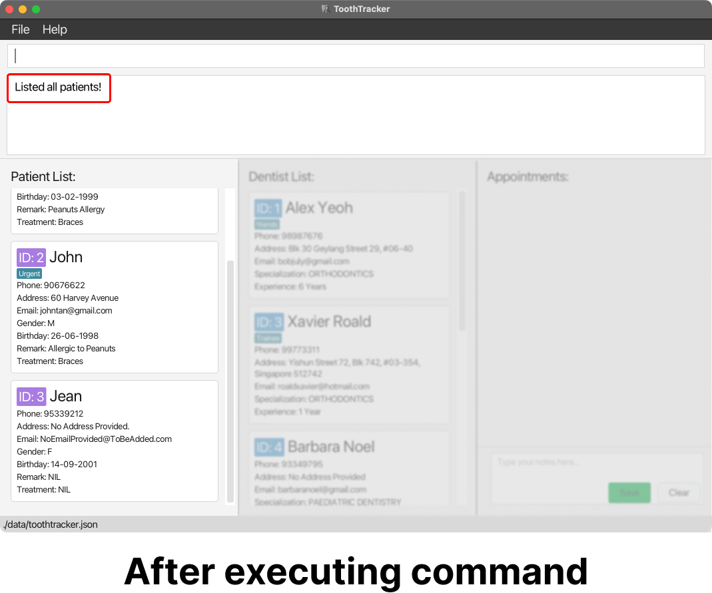{: .centered-image }

#### Deleting a patient : `delete-patient`

Deletes the patient with the specified `PATIENT_ID` from ToothTracker.

**Format:** `delete-patient PATIENT_ID`

:exclamation: **CAUTION:**
This command is DESTRUCTIVE! Patients deleted will need to be added back and their previous records may be removed.
**Proceed with caution!**

:bulb: **Tip:**
To check the `PATIENT_ID` of a patient, you can simply enter the command `list-patient`.

Examples:
* `delete-patient 5`   This deletes the patient with the `PATIENT_ID` 5.
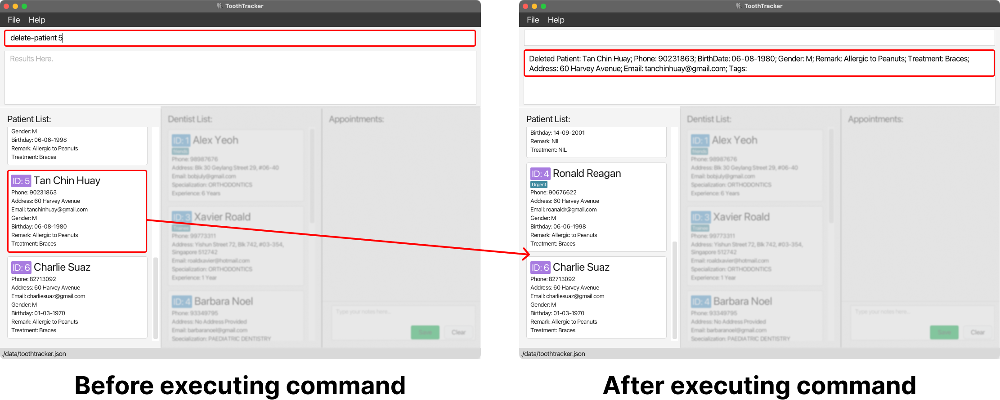{: .centered-image }

* `delete-patient 34`   This deletes the patient with the `PATIENT_ID` 34.
{: .centered-image }

#### Searching for patients by `PATIENT_ID` : `search-patient`

Searches for a patient by their `PATIENT_ID` in ToothTracker.
This command helps you find a unique patient based on the provided `PATIENT_ID`. This is useful when:
* You want to confirm the identity of a specific patient before using further commands.
* You need quick access to one specific patient's particulars.

**Format:** `search-patient PATIENT_ID`

:bulb: **Tip:**
The `PATIENT_ID` refers to the ID shown in the displayed list of patients.  
To check the `PATIENT_ID` of a patient, you can simply enter the command `list-patient`.

**Examples:**
* `search-patient 2`   This searches for the patient with `PATIENT_ID` 2.
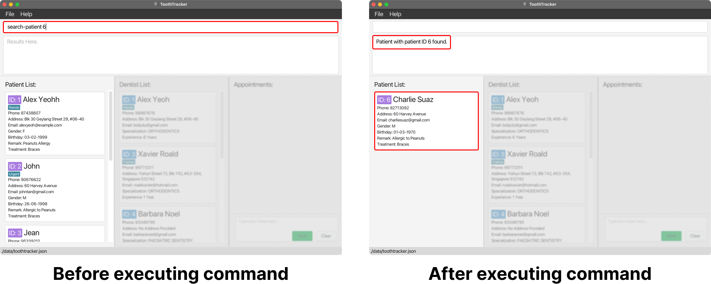{: .centered-image }

* `search-patient 8`   This searches for the patient with `PATIENT_ID` 8.

#### Searching for patients by keywords : `search-patient`

Search for patients by matching names with a keyword.
This command helps you find patients that match your search criteria. This is useful when:
* You need to find patients whose names match your search criteria
* You forget the `Patient_ID` for a patient and want to search using the patient's name instead.

**Format:** `search-patient KEYWORD`

**:information_source: Notes for searching patients by keyword** 
  <ul>
    <li>The search is performed only on the patient's name.</li>
    <li>The search is case-insensitive, meaning that it will match both uppercase and lowercase characters. For example, searching for `James` will match both `James` and `james`.</li>
    <li>The order of the keywords in the name does not matter. For instance, searching for `Mike Lim` will match `Lim Mike` as well.</li>
    <li>Sub-strings will be matched. For example, if you search for `Fred`, it will match `Frederick`.</li>
    <li>More than one patient result might be returned when searching by keywords, especially if multiple patients match your search criteria.</li>
  </ul>

**Examples:**
* `search-patient John`   This searches for patients with names containing the keyword `John`.
{: .centered-image }

* `search-patient Ronald Lim`   This searches for patients with names containing the keyword `Ronald Lim`.

#### Filtering patients : `filter-patient`

Narrows down your search for patients based on a specified attribute.
When this command is used, there might be more than one result that matches your search criteria. This is useful when:
* You want to find patients with specific attributes.
* You want to confirm the identity of a patient before using further commands.

**Format:** `filter-patient a/ATTRIBUTE k/KEYWORDS`

:bulb: **Tip:**
To check the attributes that you can filter by, you can simply enter the command `list-patient`.
Alternatively, a message will be shown in the text box regarding the attributes that you can filter by if you entered an invalid attribute.
We have set the attributes that can be filtered to be:
`name`, `phone`, `birthday`, `gender`, `remark`, `treatment`, `email`, `address`, `tags`.

**Examples:**
* `filter-patient a/phone k/81076655`   This filters for patients with the phone number '81076655'.
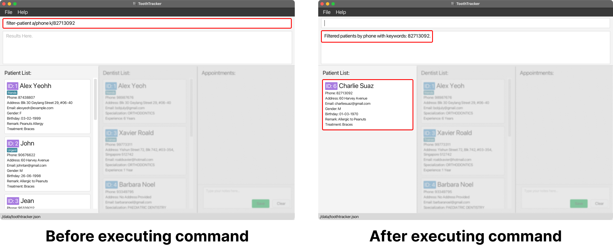{: .centered-image }

* `filter-patient a/treatment k/Braces`   This filters for patients with the treatment 'Braces'.
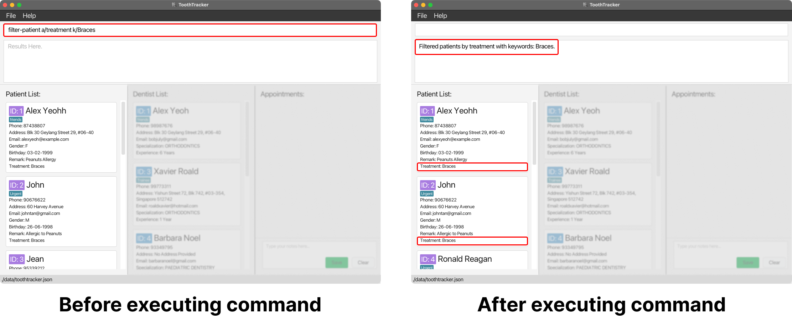{: .centered-image }

#### Editing a patient : `edit-patient`

Edits one or more attributes of the patient at the specified `PATIENT_ID`. This is useful when:
* The particulars of a patient need to be updated.
* Optional patient particulars were not provided previously.
* You accidentally entered incorrect information about a patient into the ToothTrack database.

**Format:** `edit-patient PATIENT_ID [n/NAME] [p/PHONE] [b/BIRTHDATE] [g/GENDER] [r/REMARK] [tr/TREATMENT] [e/EMAIL] [h/ADDRESS] [t/TAG]`

:bulb: **Tip:**
You can edit the particulars in any order and edit more than one particular of the patient with a single `edit-patient` command.

:bulb: **Tip:**
To check the `PATIENT_ID` of a patient, you can simply enter the command `list-patient`.

**:information_source: Notes about editing tags:** 
When editing tags, you have to include any previous tags that was already included in the patient, or else these tags will be removed.
This also means that you can use `t/` to remove all tags from a patient using the `edit-patient` command.

**:information_source: Notes about editing Treatments:** 
The edited treatment must be a valid treatment in ToothTracker. For a list of valid treatments, you can use the command `list-treatment`.

**Examples:**
* `edit-patient 1 p/91234567 e/johndoe@example.com r/Allergic to Peanuts` 
This edits the phone number, email, and remarks of the patient with `PATIENT_ID` 1 into
'91234567', 'johndoe@example.com', and 'Allergic to Peanuts' respectively.
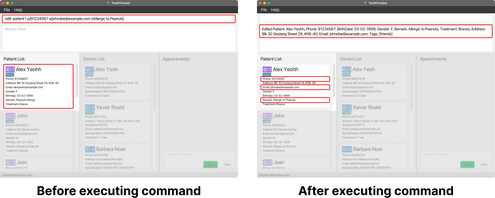{: .centered-image }

* `edit-patient 2 n/Alex`  
This edits the name of the patient with `PATIENT_ID` 2 to 'Alex'.
{: .centered-image }



### Appointment Features

#### Adding an appointment : `add-appointment`

Adds a dental appointment to ToothTracker. This is useful when:
* you want to schedule future dental appointments for patients with specific dentists at designated times.
* you want to check for clashes with existing appointments.
* you want to add in past appointments for record keeping.

**Format:** `add-appointment dentist/DENTIST_ID patient/PATIENT_ID start/START_DATE_TIME tr/TREATMENT`

**:information_source: Notes about adding Appointments:** 
  <ul>
    <li>ToothTracker will not allow the addition of appointments that clashes with existing appointments
        with the same dentist or patient.</li>
    <li>ToothTracker only allows for the addition of appointments from the year 2000 and onwards.</li>
    <li>When adding an appointment, the list of appointments shown may get filtered, resulting in the new appointment not showing up in the appointment list.
        Please use <code>list-appointment</code> if you want the new appointment to show up.</li>
  </ul>

**Example:**
* `add-appointment dentist/1 patient/1 start/2023-10-12 16:00 tr/Braces`  
This command adds an appointment with the `PATIENT_ID` 1 and the `DENTIST_ID` 1.
The appointment starts on '12 October 2023, 4pm'. The treatment provided during the appointment is 'Braces'.
The duration of the appointment is automatically set based on the selected treatment in ToothTracker.
{: .centered-image }

#### Listing all appointments : `list-appointment`

Shows a list of all appointments in ToothTracker. This is useful when:
* you want to retrieve the information of all appointments.
* you want to verify that the appointment is added to ToothTracker.

**Format:** `list-appointment` (No extra parameters required)
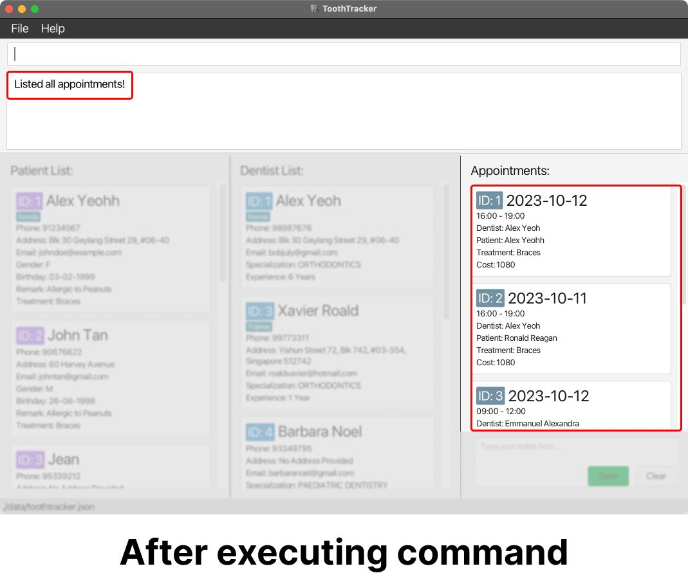{: .centered-image }

#### Deleting an appointment : `delete-appointment`

Deletes the appointment with the specified `APPOINTMENT_ID` from ToothTracker.

**Format:** `delete-appointment APPOINTMENT_ID`

:exclamation: **CAUTION:**
This command is DESTRUCTIVE!
Appointments deleted will need to be added back and their previous records may be removed.
Proceed with caution!

:bulb: **Tip:**
To check the `APPOINTMENT_ID` of an appointment, you can simply enter the command `list-appointment`.

**Example:**
* `delete-appointment 2`  
This deletes the appointment with `APPOINTMENT_ID` 2 from ToothTracker.
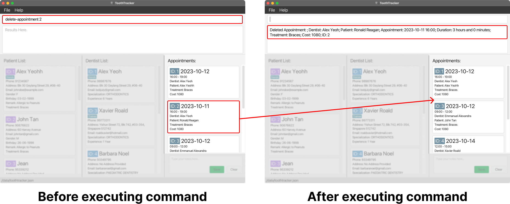{: .centered-image }

#### Filtering Appointments by `DENTIST_ID` : `filter-appointment dentist`

Narrows down your search for appointments by filtering the appointment list to
show the list of appointments under the dentist with the specified `DENTIST_ID`.
This is useful when:
* you want to view the list of appointments under a specific dentist.

**Format:** `filter-appointment dentist DENTIST_ID`

:bulb: **Tip:**
`DENTIST_ID` refers to the ID shown in the displayed list of dentists.  
You may use `list-dentist` to check out the `DENTIST_ID` first.

**Example:**
* `filter-appointment dentist 1`  
This gives you all appointments under the dentist with `DENTIST_ID` 1.
{: .centered-image }

#### Filtering Appointments by `PATIENT_ID` : `filter-appointment patient`

Narrows down your search for appointments by filtering the appointment list to
show the list of appointments under the patient with the specified `PATIENT_ID`.
This is useful when:
* you want to view the list of appointments under a specific patient.

**Format:** `filter-appointment patient PATIENT_ID`

:bulb: **Tip:**
`PATIENT_ID` refers to the index number shown in the displayed list of patients.  
You may use `list-patient` to check out the `PATIENT_ID` first.

**Example:**
* `filter-appointment patient 1`  
This gives you all appointments under the patient with the `PATIENT_ID` 1.
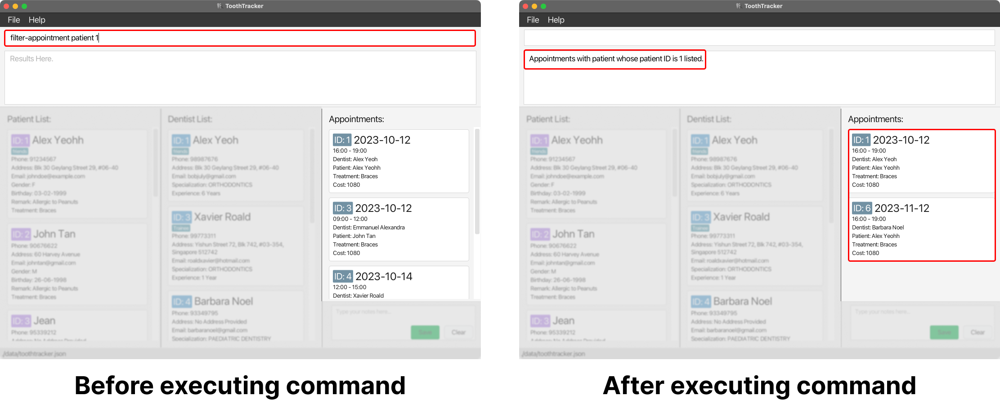{: .centered-image }



### Treatment Features

#### Adding a treatment : `add-treatment`

Adds a dental treatment to the ToothTracker system.
This command allows you to specify the treatment name, the cost of treatment, and how long the treatment would take.

**Format:** `add-treatment tr/NAME cs/PRICE ti/DURATION`

**:information_source: Notes about adding treatments with the same name:** 
Each treatment must have a unique name. ToothTracker does not allow multiple treatments with identical names.

**Example:**
* `add-treatment tr/Tooth Extraction cs/1080 ti/10:30`  
This adds a 'Tooth Extraction' treatment to ToothTracker with a cost of '$1080 SGD', and duration of '10 hours and 30 minutes'.
{: .centered-image }

#### Listing all treatments : `list-treatment`

Shows a list of all treatments in ToothTracker. This is useful when:
* You want to view the currently available treatments stored in ToothTracker.

Format: `list-treatment` (No extra parameters required)
{: .centered-image }

#### Deleting a treatment : `delete-treatment`

Deletes the treatment with the specified `TREATMENT_NAME` from ToothTracker.

**Format:** `delete-treatment TREATMENT_NAME`

:exclamation: **CAUTION:**
This command is DESTRUCTIVE!
Treaments deleted will need to be added back and their previous records may be removed.
Proceed with caution!

:bulb: **Tip:**
`TREATMENT_NAME` must be an **exact** match (case-sensitive) with the name of the treatment to be deleted.

**Example:**
* `delete-treatment Braces`   This deletes the treatment `Braces` from ToothTracker.
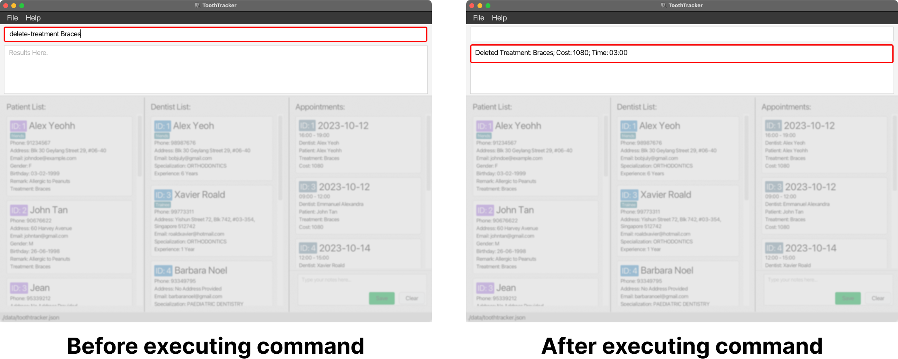{: .centered-image }



### Calendar Features

#### Viewing calendar : `view-calendar`

Shows a calendar filled with all scheduled appointments in ToothTracker. This is useful when:
* You want a visual summary of all appointments, allowing for a comprehensive overview.

Format: `view-calendar` (No extra parameters required)
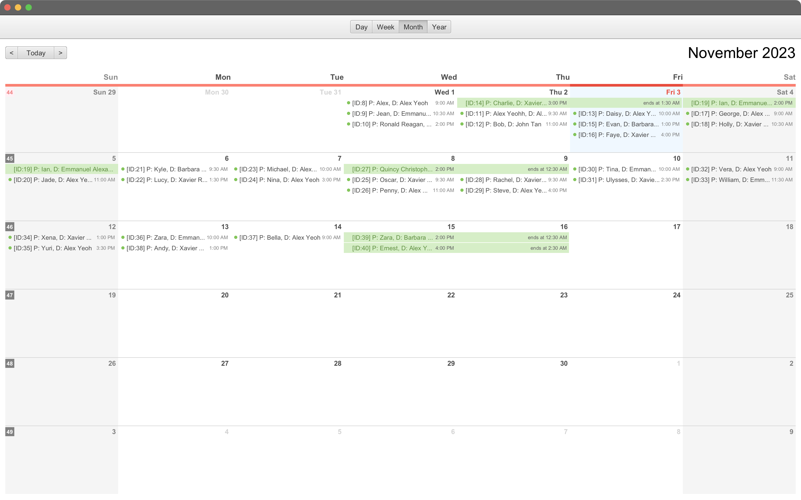{: .centered-image }

### General Features

#### Viewing help : `help`

Shows a message explaining how to access the help page.

**Format**: `help`

{: .centered-image }

#### Clearing all data : `clear`

Clears all data from ToothTracker. **PROCEED WITH CAUTION!**

:exclamation: **CAUTION:**
Data cleared cannot be recovered.

**Format:** `clear`

#### Exiting the program : `exit`

Exits ToothTracker app.

**Format:** `exit`

#### Saving the data
ToothTracker data is saved in the hard disk automatically after any command that changes the data. There is no need to
save manually.

#### Editing the data file
ToothTracker data is saved automatically as a JSON file `[JAR file location]/data/toothtracker.json`. Advanced users are
welcome to update data directly by editing that data file.

:exclamation: **CAUTION:**
If your changes to the data file makes its format invalid, ToothTracker will discard all data and start with an empty
data file at the next run. Hence, it is recommended to take a backup of the file before editing it.



## Troubleshooting
 
{: .no_toc}
#### Checking your system's Java version
Check that your system has the correct Java version (**Java 11 and above**) installed to run ToothTracker. Follow the steps below:

- For Windows Users:
  1. Press `Win + S` to open search.
  2. Type in `Terminal` and open the terminal.
  3. Key in `java --version` and press `Enter` to check your Java version.

- For macOS Users:
  1. Press `Cmd + Space` to launch Spotlight. 
  2. Type in `Terminal` and open the terminal. 
  3. Key in `java --version` and press `Return` to check your Java version.

- For Linux Users:
  1. Press `Ctrl + Alt + T` to open the Terminal. 
  2. Key in `java --version` and press `Enter` to check your Java version.

The following image shows an example of what will show up on macOS. You can expect a similar result if you’re using another operating system.
{: .centered-image }

The number in the red box highlights the Java version your system currently has.
In the example, the system is running Java 11.0.19, which meets the requirement for ToothTracker.

If you hava an earlier version of Java installed, head over to
[Oracle's Java download page](https://docs.oracle.com/en/java/javase/11/install/overview-jdk-installation.html#GUID-8677A77F-231A-40F7-98B9-1FD0B48C346A) to install the correct version of Java.



## FAQ

**Q**: How do I transfer my data to another Computer? 
**A**: Install the app in the other computer and overwrite the empty data file it creates with the file that contains
the data of your previous ToothTracker home folder.

**Q**: I don't have Java 11, how do I install it on my computer? 
**A**: You can find detailed installation instructions [here](https://docs.oracle.com/en/java/javase/11/install/overview-jdk-installation.html#GUID-8677A77F-231A-40F7-98B9-1FD0B48C346A)
and install Java 11 according to your platform.

**Q**: Why do I get an error while trying to edit an existing dentist/patient? 
**A**: The dentist/patient to be edited may not be shown in ToothTracker.
To display the to-be-edited dentist/patient, you may use these commands:
1. `list-dentist` or `list-patient`
2. `search-dentist` or `search-patient`

Thereafter, you may edit the particulars using `edit-dentist` or `edit-patient` with their `DENTIST_ID` or `PATIENT_ID`
respectively.



## Known issues

1. **When using multiple screens**, if you move the application to a secondary screen, and later switch to using only
   the primary screen, the GUI will open off-screen. The remedy is to delete the `preferences.json` file created by the
   application before running the application again.


## Fields summary

| Field       | Description                                                               | Examples                                          |
|-------------|---------------------------------------------------------------------------|---------------------------------------------------|
| **ti**      | Represents the total duration of the `treatment` in hours and minutes.    | `ti/10:30` `tr/09:59`                             |
| **cs**      | Represents the total cost of the `treatment` in dollars.                  | `cs/3000` `cs/500`                                |
| **tr**      | Represents the name of the `treatment`                                    | `tr/Whitening` `tr/Braces`                        |
| **start**   | Represents the start date time of a `appointment` in `yyyy-mm-dd hh:mm`   | `start/2023-01-01 09:05` `start/2021-10-12 16:00` |
| **patient** | Represents the unique ID of the patient when adding a `appointment`       | `patient/1` `patient/45`                          |
| **dentist** | Represents the unique ID of the dentist when adding a `appointment`       | `dentist/1` `dentist/45`                          |
| **y**       | Represents the years of experience of the dentist when adding a `dentist` | `y/5` `y/10`                                      |
| **s**       | Represents the specialization of the dentist when adding a `dentist`      | `s/Orthodontics` `s/DENTAL_PUBLIC_HEALTH`         |
| **r**       | Represents a optional `remark` when adding a `patient`                    | `r/Peanut Allergy` `r/Soya Allergy`               |
| **g**       | Represents  gender of a                                                   | `g/M` `g/F`                                       |
| **b**       | Represents the birthday of a  `patient` in `dd-mm-yyyy`                   | `b/06-06-1998` `b/12-11-2002`                     | 
| **t**       | Represents  an optional tag for a `patient` or `dentist`                  | `t/urgent` `t/Not Urgent`                         | 
| **e**       | Represents  an optional email address for a `patient` or `dentist`        | `e/freddy@gmail.com` `e/john@youmail.com`         | 
| **h**       | Represents  a home address for a `patient` or `dentist`                   | `h/123, Clementi Ave 3, #12-34` `h/8 Farrer Road` |
| **p**       | Represents a phone number                                                 | `p/97826376` `p/92837263`                         |
| **n**       | Represents a name                                                         | `n/John` `n/Tom`                                  |
   



## Command summary

### Dentist Commands

| Action                           | Format                                                                                                     | Example                                                                                                                               |
|----------------------------------|----------------------------------------------------------------------------------------------------------------------------------------------------------------------------------------------------------------------------------------------------|
| **Add Dentist**                  | `add-dentist n/NAME p/PHONE s/SPECIALIZATION y/YOE [e/EMAIL] [h/ADDRESS] [t/TAG]…​`                     | `add-dentist n/Bob p/12345678 e/bobjune@gmail.com y/6 s/braces`                                                                       |
| **List Dentist**                 | `list-dentist`                                                                                             | `list-dentist`                                                                                                                        |
| **Delete Dentist**               | `delete-dentist DENTIST_ID`                                                                                | `delete-dentist 3`                                                                                                                    |
| **Search Dentist by Dentist ID** | `search-dentist DENTIST_ID`                                                                                | `search-dentist 2`                                                                                                                    |
| **Search Dentist by Keyword**    | `search-dentist KEYWORD`                                                                                   | `search-dentist Tom`                                                                                                                  |
| **Filter Dentist**               | `filter-dentist a/ATTRIBUTE k/KEYWORDS`                                                                    | `filter-dentist a/phone k/90182211`                                                                                                   |
| **Edit Dentist**                 | `edit-dentist DENTIST_ID [n/NAME] [p/PHONE] [e/EMAIL] [a/ADDRESS] [s/SPECIALIZATION] [y/YOE] [t/TAG]…​` | `edit-dentist 1 p/98987676 e/bobjuly@gmail.com`                                                                                       |

### Patient Commands

| Action                           | Format                                                                                                                | Example                                                                                                                               |
|----------------------------------|-----------------------------------------------------------------------------------------------------------------------|---------------------------------------------------------------------------------------------------------------------------------------|
| **Add Patient**                  | `add-patient n/NAME p/PHONE b/BIRTHDATE g/GENDER [r/REMARK] [tr/TREATMENT] [e/EMAIL] [h/ADDRESS] [t/TAG]…​`           | `add-patient n/John p/90676622 b/06-06-1998 g/M r/Allergic to Peanuts tr/Braces e/johntan@gmail.com h/60 Harvey Avenue t/Urgent`   |
| **List Patient**                 | `list-patient`                                                                                                        | `list-patient`                                                                                                                        |
| **Delete Patient**               | `delete-patient PATIENT_ID`                                                                                           | `delete-patient 3`                                                                                                                    |
| **Search Patient by Patient ID** | `search-patient PATIENT_ID`                                                                                           | `search-patient 3`                                                                                                                    |
| **Search Patient by Keyword**    | `search-patient KEYWORD`                                                                                              | `search-patient John`                                                                                                                 |
| **Filter Patient**               | `filter-patient a/ATTRIBUTE k/KEYWORDS`                                                                               | `filter-patient a/phone k/98776211`                                                                                                   |
| **Editing Patient**              | `edit-patient PATIENT_ID [n/NAME] [p/PHONE] [b/BIRTHDATE] [g/GENDER] [r/REMARK] [tr/TREATMENT] [e/EMAIL] [h/ADDRESS] [t/TAG]…​` | `edit-patient 1 p/91234567 e/johndoe@example.com r/Allergic to Peanuts`                                                  |

### Appointment Commands

| Action                           | Format                                                                                                     | Example                                                                                                                       |
|----------------------------------|------------------------------------------------------------------------------------------------------------|-------------------------------------------------------------------------------------------------------------------------------|
| **Add Appointment**              | `add-appointment dentist/DENTIST_ID patient/PATIENT_ID start/START_TIME tr/TREATMENT`  | `add-appointment dentist/1 patient/1 start/2023-10-12 16:00 tr/Braces`                                                        |
| **List Appointment**             | `list-appointment`                                                                     | `list-appointment`                                                                                                            |
| **Delete Appointment**           | `delete-appointment APPOINTMENT_ID`                                                    | `delete-appointment 3`                                                                                                        |
| **Filter Appointment by Dentist ID** | `filter-appointment dentist DENTIST_ID`                                            | `filter-appointment dentist 1`                                                                                                |
| **Filter Appointment by Patient ID** | `filter-appointment patient PATIENT_ID`                                            | `filter-appointment patient 1`                                                                                                |

### Treatment Commands

| Action                           | Format                                       | Example                                             |
|----------------------------------|----------------------------------------------|-----------------------------------------------------|
| **Add Treatment**                | `add-treatment tr/NAME cs/PRICE ti/DURATION` | `add-treatment tr/Tooth Extraction cs/150 ti/01:00` |
| **List Treatment**               | `list-treatment`                             | `list-treatment`                                    |
| **Delete Treatment**             | `delete-treatment NAME`                      | `delete-treatment Braces`                           |

### Calendar Commands

| Action            | Format          | Example         |
|-------------------|-----------------|-----------------|
| **View calendar** | `view-calendar` | `view-calendar` |

### General Commands

| Action                | Format           | Example |
|-----------------------|------------------|---------|
| **Help**              | `help`           | `help`  |
| **Clear all data**    | `clear`          | `clear` |
| **Exit ToothTracker** | `exit`           | `exit`  |

## Acknowledgements
- ToothTracker uses the following libraries: [JavaFX](https://openjfx.io/), [Jackson](https://github.com/FasterXML/jackson), [JUnit5](https://github.com/junit-team/junit5), [CalendarFX](https://github.com/dlsc-software-consulting-gmbh/CalendarFX)
- User Guide references the following projects: [FoodRem](https://github.com/AY2223S1-CS2103T-W16-2/tp/blob/2a34fab143ace403adeb4b923258468140b66200/docs/UserGuide.md), [ArtBuddy](https://github.com/AY2223S1-CS2103T-W11-3/tp/blob/master/docs/UserGuide.md)

